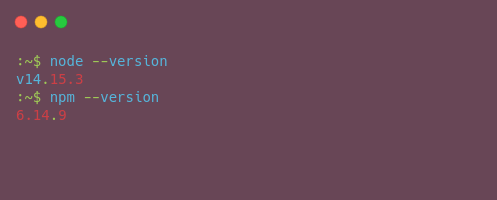
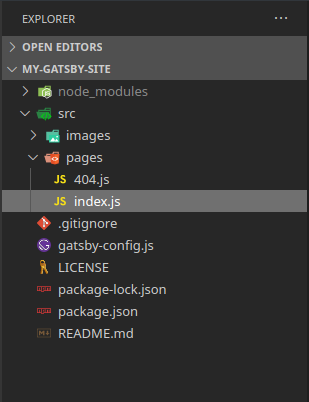
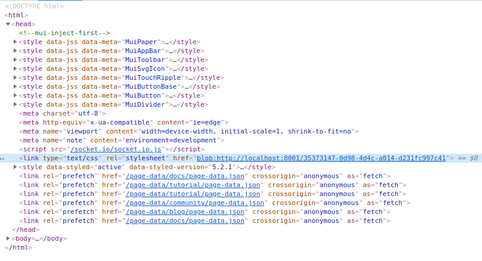
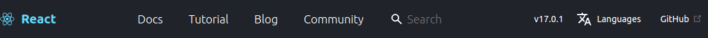

Impatient ? navigate [☛ to this link](https://reactjs-clone.netlify.app/) to see what you're going build.

### Introduction

when you google for react ui libraries the first reasult you'll see is is a top 10 React components Libraries for 2020, for a newcomers to the industrie of web developing  this result will frustrate theme, just like it did when i first start learning about React, React-Frameworks and UI librarie.

thats what pushed me to write this particular blog post.

for me there's no top 10 or anything because they all speak the same language wich is *React* and i think they will made a great couple if we put them in the same project.

in this post you will play the role of **Cupidon** ❤︎ with material-ui and react-bootstrap, but first let's set up the envirenemnt for them to be able to communicate.

### envirenement setup

> to be able to follow along with this quick tutorial you need to have a basic basic knowledge of **React** as well as **Bootstrap** and to be familare with your **command line**

first check if you have the following installed on your machine, if not navigate to the official website for each, follow the Guides to install themes depends on you Operating system.

1. [nodejs (npm)](https://nodejs.org/en/)
2. [git](https://git-scm.com/)
3. [gatsby CLI](https://www.gatsbyjs.com/docs/reference/gatsby-cli/)

follow this step by step [tutorial](https://www.gatsbyjs.com/docs/tutorial/part-zero/) from the official gatsby site. to get started with **Gatsby** the Where our two lovers will meet 💜.

if you have already installed and configured this tools lets quick check our versions before we start.

run the following commande from your command line (console).

```bash
> node --version
> npm --version
```

The output should look similar to the screenshot below, showing version numbers in response to the commands.




next install gatsby CLI globaly and init a new gatsby project.

```bash
> npm install -g gatsby-cli
```
after installing the cli, run the following : 

```bash
> gatsby new

This command will generate a new Gatsby site for you in
/whereever-you-choosed with the setup you select. Let's answer some questions:

What would you like to call your site?
✔ · My Gatsby Site
What would you like to name the folder where your site will be created?
✔ pp/ my-gatsby-site
? Will you be using a CMS?
(Single choice) Arrow keys to move, enter to confirm
· No (or I'll add it later)
? Would you like to install a styling system?
· styled-components
? Would you like to install additional features with other plugins?
(Multiple choice) Use arrow keys to move, enter to select,
and choose "Done" to confirm your choices
 ◯ Add the Google Analytics tracking script
 ◯ Add responsive images
 ◯ Add page meta tags with React Helmet
 ◯ Add an automatic sitemap
 ◯ Enable offline functionality
 ◯ Generate a manifest file
 ◉ Add Markdown support (without MDX)
 ◯ Add Markdown and MDX support
  ─────
```

The **CLI** will run an interactive shell asking for the above options before creating a Gatsby site for you.

make sure to select *styled-components* for styling system?,  Add *Markdown* support (without MDX) for additional features.

after the installation finishes open the project folder with your Text editor.

Inside teh **Gatsby project**, you will see somthing like the screenshot below. for more details about the role of each file or folder check the [official gatsby docs](https://www.gatsbyjs.com/docs/reference/gatsby-project-structure/#files) about the topic.




back to your command line, add **react-bootstrap** and **Material-Ui** libraries.

```bash
> npm install react-bootstrap bootstrap
> npm install @material-ui/core
> npm install @material-ui/icons
> npm install gatsby-plugin-material-ui
```

>Note the last dependency is the **gatsby-plugin-material-ui**, we will configure this plugin to **override** the default styling by **injecting** the material-ui styles first.

##### The Gatsby Config File:

In the root of your project you have the *gatsby-config.js* file, 
this file let us configure the gatsby [plugins](https://www.gatsbyjs.com/plugins/) to add functionality 
and customize our Gatsby apps, in our case we need to override the
[material-ui](https://material-ui.com/) styles.

Open the gatsby.config.js file and update the plugins array. 


```javascript
// gatsby-config.js
module.exports = {
  siteMetadata: {
    title: "name of your site",
  },
  plugins: [
    "gatsby-plugin-styled-components",
    "gatsby-transformer-remark",
    {
      resolve: `gatsby-plugin-material-ui`,
      options: {
        stylesProvider: {
          injectFirst: true,
          },
      },
    },
    {
      resolve: "gatsby-source-filesystem",
      options: {
        name: "pages",
        path: "./src/pages/",
      },
      __key: "pages",
    },
  ],
};
```
This is  all we need to configure **material-ui** library with **Gatsby**, next we configure react-bootstrap.

##### the gatsby browser file:

depends on the starter you used in the gatsby installation it may or may not contain the **gatsby-browser.js**.

add the file to the root of your project, copy and past the following code to it.

```javascript
//gatsby-browser.js
import 'bootstrap/dist/css/bootstrap.min.css';
```
>This file gives us the abilty to interacte with the client-side of Gatsby. in our case we just made bootstrap styles globally available.
run 

```bash
> gatsby develop
```
open the browser at *https://localhost:8000* open the devtools, inside the `<head>` tag you will see that the bootstrap styles that we imported in the **gatsby-browser.js** file are injected just like we wanted.



> notice that at the top of the `<head>` tag we have this <!--mui-inject-first--> followed by some `<style>` tags, those are comming from the material-ui styles remember when we configured the plugin to inject the styles first, at this stage you'll not get any styles tags because we didn't import any **MUI component** yet.

##### The Layout component:

to start creating components create the *layout.js* file inside `/src/componets` folder.

copy and past the following code to it.

```javascript
// src/components/layout.js
import React from 'react'
import {
    Container
} from 'react-bootstrap'
import PrimarySearchAppBar from './app-bar'
import { createGlobalStyle } from 'styled-components'
const GlobalStyle = createGlobalStyle`
body,html{
    margin:0;
    padding:0;
    font-family: Segoe UI, Roboto, Oxygen, Ubuntu, Cantarell,
                 Fira Sans, Droid Sans, Helvetica Neue, sans-serif;
    font-weight: 400;
}
h1,h2,h3{
    color: #61dafb;
}
`
const Layout = ({ children }) => {
    return (
        <React.Fragment>
            <GlobalStyle />
            <Container fluid className="px-0">
                <PrimarySearchAppBar />
                <Container fluid className="px-0 pt-5">
                    {children}
                </Container>
            </Container>
        </React.Fragment>
    )
}
export default Layout
```
if you save and run the `gatsby develop` command you will not see any difference, because we are not using this component any where in our pages.

open the index.js file from src/pages/ folder and update  it to mathch the following.

```javascript
// src/pages/index.js
import * as React from "react"
import Layout from '../components/layout'
const IndexPage = () => {
  return (
    <Layout>
    </Layout>
  )
}
export default IndexPage
```
the role of `<Layout>` component is to wrapp the pages with the same shared layout.

run the `gatsby develop` command and you'll get an error

```bash
  32:18  error  'PrimarySearchAppBar' is not defined  react/jsx-no-undef

✖ 1 problem (1 error, 0 warnings)

File: src/components/layout.js

failed Building development bundle - 17.015s
```

we are expecting this because we are importing a component that we didn't define yet.

##### The App Bar Component:





create app-bar.js in the components folder and add the following code.

```js
// src/components/app-bar.js
import React from 'react';
import AppBar from '@material-ui/core/AppBar';
import Toolbar from '@material-ui/core/Toolbar';
import TranslateIcon from '@material-ui/icons/Translate';
import LaunchIcon from '@material-ui/icons/Launch';
import {
  Row,
  Col
} from 'react-bootstrap'
import { Link } from 'gatsby';

export default function PrimarySearchAppBar() {

  return (
    <AppBar position="fixed" className="app-bar px-lg-5">
        <Toolbar className="toolbar">
            <Row className="align-items-center justify-content-center flex-grow-1">
                <Col xs={1} md={2} className="d-flex justify-content-start">
                    <Link to={`/`} className="d-flex react-logo">
                        
                        <span>
                            React
                        </span>
                    </Link>
                </Col>
                <Col xs={7} md={4} className="d-flex align-items-center justify-content-lg-end">
                    <Link to={`/docs`} className="link-bsb px-2 px-lg-3" >
                        Docs
                        </Link>
                    <Link to={`/tutorial`} className="link-bsb px-2 px-lg-3" >
                        Tutorial
                        </Link>
                    <Link to={`/blog`} className="link-bsb px-2 px-lg-3" >
                        Blog
                        </Link>
                    <Link to={`/community`} className="link-bsb px-2 px-lg-3" >
                        Community
                    </Link>
                </Col>
                <Col xs={2} lg={3} className="d-flex align-items-center justify-content-end">
                    <input
                        className="ml-4"
                        placeholder='Search'
                    />
                </Col>
                <Col xs={1} md={3} lg={3} className="d-flex align-items-center justify-content-center">
                    <Link to={`/docs`} className="link-asb mx-md-2">
                        v17.0.1
                    </Link>}
                    <Link to={`/tutorial`} className="link-asb mx-md-2">
                        <TranslateIcon className="mx-md-2" />
                        <span>
                            Languages
                        </span>
                    </Link>
                    <a href="https://github.com/facebook/react/" className="link-asb mx-md-2">
                      GitHub
                      <LaunchIcon
                        fontSize="inherit"
                        className="mx-1 text-secondary"/>
                    </a>
                </Col>
            </Row>
        </Toolbar>
    </AppBar>
  )
}
```
this is where we will bring **react-bootstrap** and **Material-ui** to build a React component that combine the Two Together.

we are using `<AppBar>` and the `<Toolbar>` components to wrap our Navigation links, the `<Row>` and `<Col>` components are used for our **Layout** needs.


> the material-ui library also provide components such as [Grid](https://material-ui.com/components/grid/) and [Container](https://material-ui.com/components/container/) for responsive layout, follow the links to know more about it.

Notice in `<AppBar position="fixed" className="app-bar px-lg-5">` the *ClassName* property the class **px-lg-5** is a bootstrap class that apply padding-left and padding-right (3rem) on larger screen to the AppBar, and it override the default padding values of the AppBar, remember that we injected all material-ui styles first. 

the **app-bar** class is comming from the *<AppBarStyles>* that we will add next to add custom styles to look just like the [reactjs](https://reactjs.org/) website.

update the app-bar.js by adding the custom styles.

```js
// src/components/app-bar.js
...
import styled from 'styled-components'
const AppBarStyles = styled.div`
    .app-bar{
        background:#20232a;
    }
    .react-logo{
        color: #61dafb;
        &:hover{
            text-decoration:none;
        }
        &:focus{
            color:#fff;
        }
        span{
            color: inherit;
            margin-left: 10px;
            font-weight: 700;
            font-size: 20px;
            line-height: 20px;
        }
    }
    .link-bsb{
        color:#fff;
        font-weight: 300;
        height:64px;
        min-height:56px;
        display:flex;
        align-items:center;
        &:hover{
            text-decoration: none;
            color: #61dafb;
        }
        &:focus{
            outline: 0;
            background-color: #373940;
            color: #ffffff;
        }
    }
    .link-asb{
        color:#fff;
        font-weight: 300;
        display:flex;
        font-size:14px;
        align-items:center;
        &:hover{
            text-decoration: none;
            color: #61dafb;
        }
        &:focus{
            outline: 0;
            background-color: #373940;
            color: #ffffff;
            border-radius: 15px;
        }
    }
    .search-bar{
        width: 16px;
        background: transparent;
        border: 0;
        color: #ffffff;
        font-size: 18px;
        font-weight: 300;
        font-family: inherit;
        padding: 4px 4px 4px 29px;
        background-image: url('/img/search.svg');
        background-size: 16px 16px;
        background-repeat: no-repeat;
        background-position-y: center;
        background-position-x: 4px;
        transition: width 0.2s ease, padding 0.2s ease;
    }
    .search-bar:focus{
        outline: 0;
        background-color: #373940;
        border-radius: 0.25rem;
        width:8rem;
    }

`
export default function PrimarySearchAppBar() { ...

```
next wrap our entire `<AppBar>` with `<AppBarStyles>`.

```javascript
// src/components/app-bar.js
...
<AppBarStyles>
  <AppBar>
   ...
  </AppBar>
</AppBarStyles>
...
```
material-ui provide a CSS media query hook. It allows the rendering of components based on whether the query matches or not, [read more ☚](https://material-ui.com/components/use-media-query/#usemediaquery) about it.

update the file by adding the following

```javascript
// src/components/app-bar.js
import useMediaQuery from '@material-ui/core/useMediaQuery';
...
const breakpoints = {
    sm: "576px",
    md: "768px",
    lg: "992px",
    xl: "1200px",
}
export default function PrimarySearchAppBar() {  
    const md = useMediaQuery(`(min-width: ${breakpoints.md})`);
    const lg = useMediaQuery(`(min-width: ${breakpoints.lg})`);
...
```

the way we're using this breakpoints is to render a component if the useMediaQuery hook return true, the case of the *Github link*, or to applie styles in this case the `<input>` width property.

update the file to match the following code:

```javascript
// src/components/app-bar.js

<AppBarStyles>
  <AppBar position="fixed" className="app-bar px-lg-5">
      <Toolbar className="toolbar">
          <Row className="align-items-center justify-content-center flex-grow-1">
              <Col xs={1} md={2} className="d-flex justify-content-start">
                  <Link to={`/`} className="d-flex react-logo">
                      
                      {md &&
                          <span>
                              React
                          </span>
                      }
                  </Link>
              </Col>
              <Col xs={7} md={4} className="d-flex align-items-center justify-content-lg-end">
                  <Link to={`/docs`} className="link-bsb px-2 px-lg-3" >
                      Docs
                      </Link>
                  <Link to={`/tutorial`} className="link-bsb px-2 px-lg-3" >
                      Tutorial
                      </Link>
                  <Link to={`/blog`} className="link-bsb px-2 px-lg-3" >
                      Blog
                      </Link>
                  <Link to={`/community`} className="link-bsb px-2 px-lg-3" >
                      Community
                  </Link>
              </Col>
              <Col xs={2} lg={3} className="d-flex align-items-center justify-content-end">
                  <input
                      className="search-bar ml-4"
                      placeholder='Search'
                      style={{
                          width: lg && "100%",
                      }}
                  />
              </Col>
              <Col xs={1} md={3} lg={3} className="d-flex align-items-center justify-content-center">
                  {md && <Link to={`/docs`} className="link-asb mx-md-2">
                      v17.0.1
                      </Link>}
                  <Link to={`/tutorial`} className="link-asb mx-md-2">
                      <TranslateIcon className="mx-md-2" />
                      {md && <span>
                          Languages
                      </span>}
                  </Link>
                  {lg && <a href="https://github.com/facebook/react/" className="link-asb mx-md-2">
                      GitHub
                      <LaunchIcon
                          fontSize="inherit"
                          className="mx-1 text-secondary" />
                  </a>}
              </Col>
          </Row>
      </Toolbar>
  </AppBar>
</AppBarStyles>
```

### Wrapping up

This is my very-first tutorial on Gatsbyjs and React in general! ⚛️

I just covered the AppBar component because it's too much for a single blog post,
you can clone the [project repository](https://github.com/okuninoshi/m-ui-X-react-bootstrap.git) and play with the source code, chalenge your self and enjoy learning ✌︎

My last word about the React UI librarie is Take the best feature, component, Layout systems ... from each one and **MIX IT UP**.